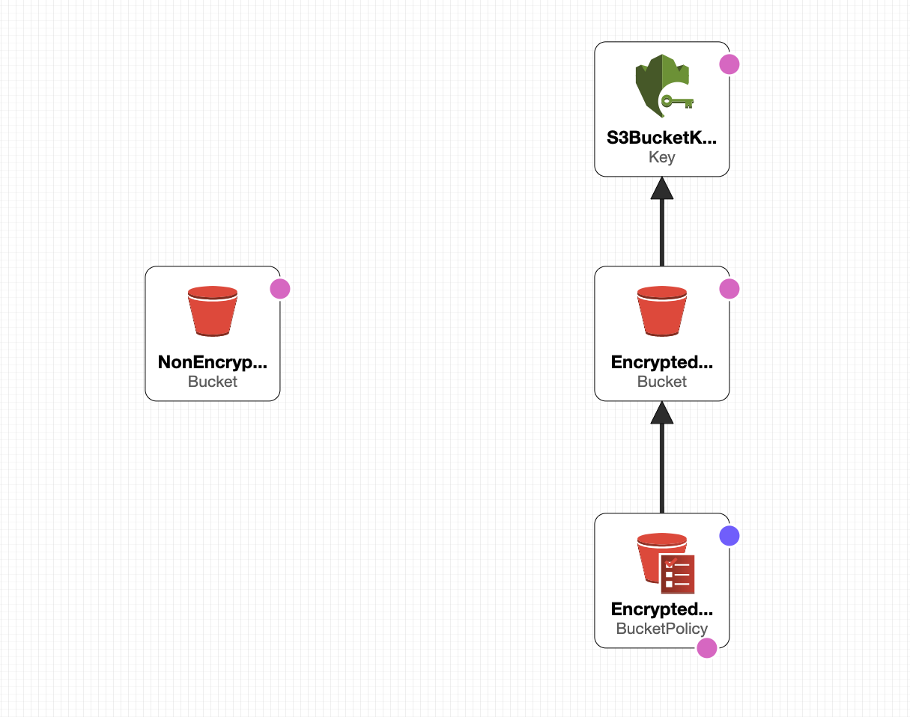
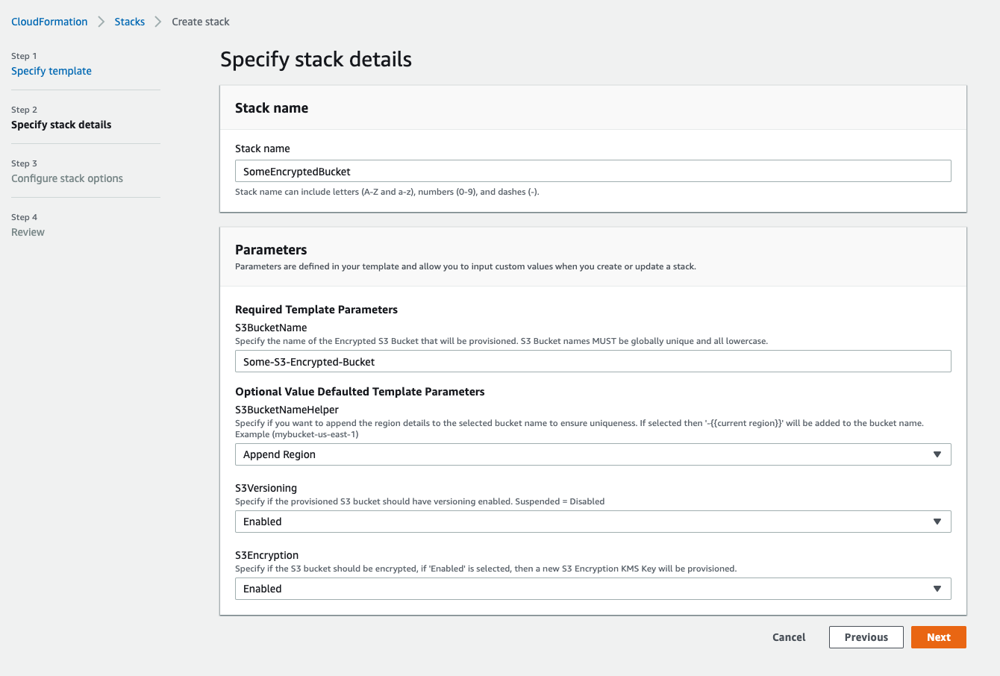

#   AWS S3 Bucket CloudFormation Template  

<br>

## Description:


The following CloudFormation template will create either a single S3 un-encrypted bucket, or if the option is selected, a fully encrypted S3 bucket that has encryption forced via an S3 bucket policy to ensure any object is transferred into the bucket over encryption (encryption in transit), as well as enforced encryption while in the bucket (encryption at rest) via a provisioned AWS KMS Encryption Key.  
 
 <br><br>

  

<br><br>

## Pre-Requisite Templates:  

The Following Templates are Pre-Requisite Templates that are required for this template to run as they will include previously provisioned resource exports that will be consumed by this template.  

<br> 

| TemplateName:  | Required Export Name  | Required Exported Resources  |
|----------------|-----------------------|------------------------------|
| None           | N/A                   | N/A                          |  

<br><br> 

## Parameters:  

The template takes the following parameters at launch:  

<br> 

#### S3BucketName:  

The name that will be applied to the created S3 bucket. The name of an S3 bucket must be composed of __lower case characters__ only, along with optional __numbers__ and the following 2 special characters __( - _ )__. This is enforced by the following regex expression set on the template parameter: ```[a-z0-9-_]*```. S3 bucket names must be globally unique, meaning that no other bucket in S3 must have the desired or specified name that is chosen for this parameter.  __*Example:*__ ```my-special-unique-bucket-name```  

<br> 

#### S3BucketNameHelper:  

This parameter has 2 selectable options: __Disable__ and __Append Region__.  __*Example:*__ ```my-special-unique-bucket-name | my-special-unique-bucket-name-us-east-1```  

* Disable - Will leave the bucket name as it is specified in the S3BucketName parameter field, making no changes to the bucket name.
* Append Region: - This selection will append the current AWS region in which the template is being ran to the end of the __S3BucketName__ parameter value.  
* __*Default Value:*__ ```Disable```  

<br>  

#### S3Versioning:  

This parameter also has 2 selectable options: __Suspended__ and __Enabled__. Choosing the Enabled selection, will turn on versioning within the provisioned bucket.  

* Suspended - Keeps S3 Object versioning off for objects put in the bucket.
* Enabled - Turns S3 Object versioning on for all objects put into the bucket.  
* __*Default Value:*__ ```Suspended```  

<br> 

#### S3Encryption:  

This parameter has 2 selectable options: __Disabled__ and __Enabled__. If Disabled is selected, the template will simply provision a single un-encrypted S3 bucket. If Enabled is selected, the template will provision a KMS Encryption Key, an Encrypted S3 bucket, that is encrypted with the provisioned KMS Key, and a bucket policy that is applied to the bucket that will force both encryption in transit and encryption at rest for all objects put into the bucket.  

* Disabled - Provisions only single un-encrypted S3 bucket.
* Enabled - Provisions KMS Key, Encrypted S3 bucket, and S3 bucket policy enforcing encryption.  
* __*Default Value:*__ ```Disabled```  

<br><br>

## Example Parameter Values:  

<br> 

  

<br><br> 

## Resources:  

The template will create the following resources at launch:  

<br>  

#### S3Encryption: Disabled  

* Single un-encrypted S3 bucket configured with the name set in the S3BucketName plus, if selected the region appended to the S3BucketName if using the S3BucketNameHelper.
* Versioning will either be enabled or disabled depending on the option chose for the S3Versioning parameter value selected.  

<br>  

#### S3Encryption: Enabled:  

* KMS Key that will be used to encrypt the objects that will be stored within the S3 bucket.
* Single encrypted S3 bucket configured with the name set in the S3BucketName plus, if selected the region appended to the S3BucketName if using the S3BucketNameHelper.
* Versioning will either be enabled or disabled depending on the option chose for the S3Versioning parameter value selected.
* S3 Bucket Policy that will be applied to the encrypted S3 bucket enforcing both encryption in transit for objects uploaded to the bucket, as well encryption at rest for all objects in the bucket.  

<br><br> 

#### KMS Key Policy:  

The provisioned KMS Key is provisioned with the following 2 key policies:  

<br>

```yaml
KeyPolicy:
  Version: "2012-10-17"
  Id: !Sub "S3-Bucket-KMS-Encryption-Key-Policy-${AWS::Region}"
  Statement:
    - Sid: "Allow Administration of the S3 Bucket KMS Encryption Key"
      Effect: "Allow"
      Principal:
        AWS: !Sub "arn:aws:iam::${AWS::AccountId}:root"
      Action:
        - "kms:Create*"
        - "kms:Describe*"
        - "kms:Enable*"
        - "kms:List*"
        - "kms:Put*"
        - "kms:Update*"
        - "kms:Revoke*"
        - "kms:Disable*"
        - "kms:Get*"
        - "kms:Delete*"
        - "kms:ScheduleKeyDeletion"
        - "kms:CancelKeyDeletion"
      Resource: "*"
    - Sid: "Allow Usage of the the S3 Bucket KMS Encryption Key"
      Effect: "Allow"
      Principal:
        AWS:
          - !Sub "arn:aws:iam::${AWS::AccountId}:root"
      Action:
        - "kms:Encrypt"
        - "kms:Decrypt"
        - "kms:ReEncrypt*"
        - "kms:GenerateDataKey*"
        - "kms:DescribeKey"
      Resource: "*"
```  

<br><br>  

#### S3 Bucket Policy:  

The provisioned S3 Bucket policy will contain the following policy statements:  

<br>

```yaml
PolicyDocument:
  Version: "2012-10-17"
  Statement:
    - Sid: "DenyNonSecureTransport"
      Effect: Deny
      Principal:
        AWS: "*"
      Action:
        - "s3:*"
      Resource:
        - !Join ['/', [!GetAtt 'EncryptedS3Bucket.Arn', "*"]]
      Condition:
        Bool:
          aws:SecureTransport: false

    - Sid: DenyIncorrectEncryptionHeader
      Effect: Deny
      Principal:
        AWS: "*"
      Action: "s3:PutObject"
      Resource:
        - !Join ['/', [!GetAtt 'EncryptedS3Bucket.Arn', "*"]]
      Condition: {"StringNotEquals": {"s3:x-amz-server-side-encryption": "aws:kms"}}

    - Sid: DenyUnEncryptedObjectUploads
      Effect: Deny
      Principal:
        AWS: "*"
      Action: "s3:PutObject"
      Resource:
        - !Join ['/', [!GetAtt 'EncryptedS3Bucket.Arn', "*"]]
      Condition: {"Null": {"s3:x-amz-server-side-encryption": "true"}}
```  

<br><br> 

## Exports:  

The template will finally create the following Exports that can be used in subsequent CFN Templates via the !ImportValue intrinsic function.  

<br>

### Encryption Enabled or Disabled:  

<br>  

| Output Logical ID:                          | Output:                                   | Output Value:                                                  | Export:                             |
|-------------------------------------------- |------------------------------------------ |--------------------------------------------------------------- |------------------------------------ |
| (Non)EncryptedS3BucketName                  | S3 Bucket Name (Optionally with region)   | ```mybucket-name / mybucket-name-${AWS::Region}}```            | ${S3BucketName}                     |
| (Non)EncryptedS3BucketArn                   | S3 Bucket ARN                             | ```arn:aws:s3:::mybucket-name```                               | ${S3BucketName}-ARN                 |
| (Non)EncryptedS3BucketDomainName            | S3 Bucket Domain Name                     | ```mystack-mybucket-kdwwxmddtr2g.s3.amazonaws.com```           | ${S3BucketName}-DomainName          |
| (Non)EncryptedS3BucketRegionalDomainName    | S3 Bucket Regional Domain Name            | ```mystack-mybucket-kdwwxmddtr2g.s3.us-east-2.amazonaws.com``` | ${S3BucketName}-Regional-DomainName |

<br><br>  

### Encryption Enabled Only Exports:  

<br>  

| Output:                | Output Description:  | Output Value:                                                                     | Export:                             |
|----------------------- |--------------------- |---------------------------------------------------------------------------------- |------------------------------------ |
| S3BucketKMSKeyId       | KMS Key Id           | ```1234abcd-12ab-34cd-56ef-1234567890ab```                                        | ${S3BucketName}-KMS-Key             |
| S3BucketKMSKeyIdArn    | KMS Key ARN          | ```arn:aws:kms:us-west-2:111122223333:key/1234abcd-12ab-34cd-56ef-1234567890ab``` | ${S3BucketName}-KMS-Key-ARN         |
